# Project Definition — Document Object Model

Class diagrams for the `tom_specs_model` package. All classes are annotated with
`@tomReflector`. Every class carries a `content: String?` field for free-form
narrative text and all form-entry fields are `String?` (document model, not
application model).

---

## 1. Top-Level Structure

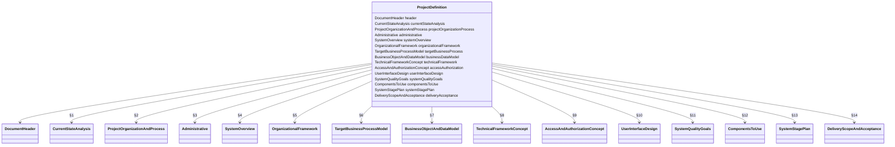

## 2. Common Types

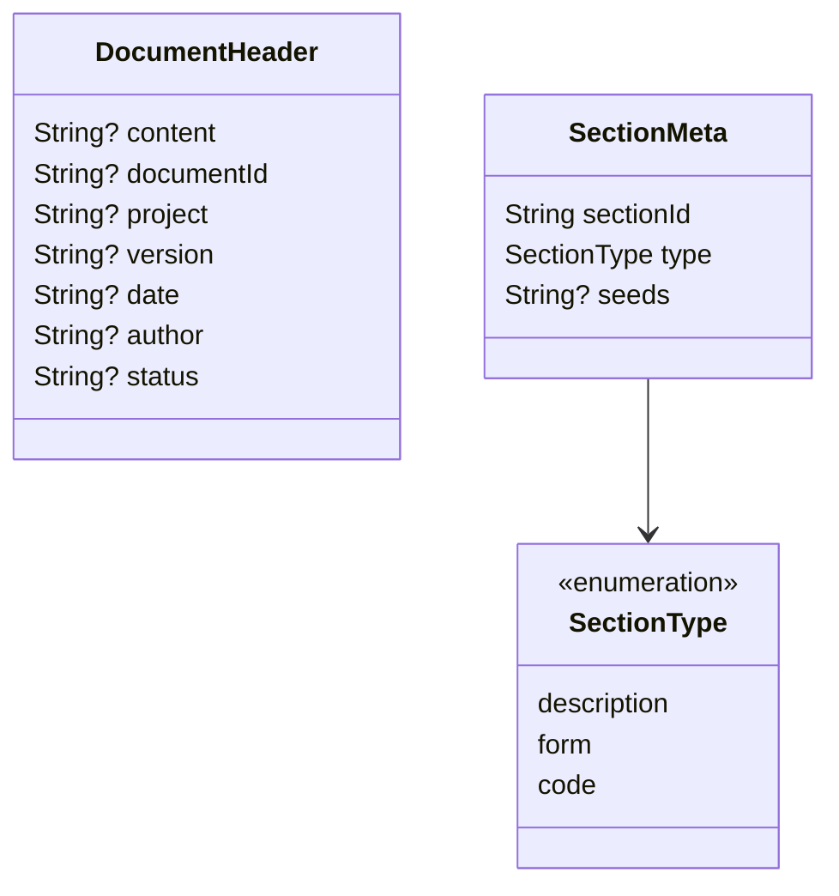

## 3. Section 1 — Current State Analysis [PD00-CUR]

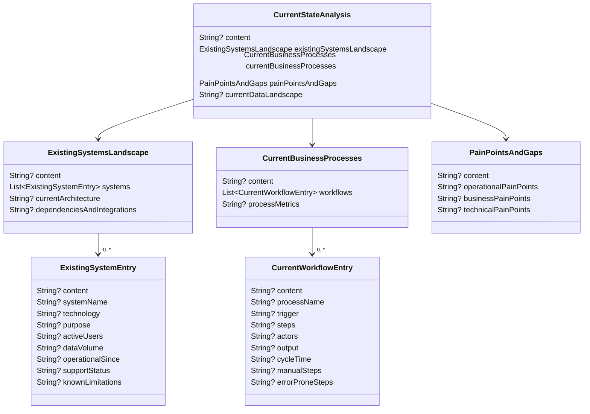

## 4. Section 2 — Project Organization and Process [PD00-POP]

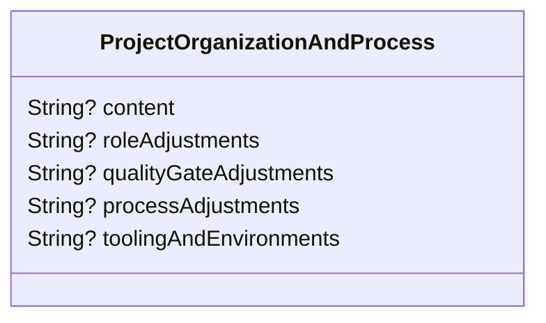

## 5. Section 3 — Administrative [PD00-ADM]

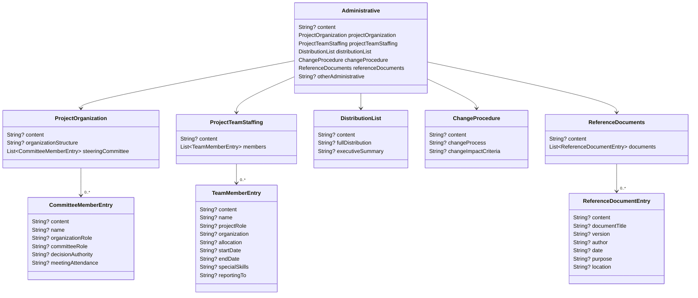

## 6. Section 4 — System Overview [PD00-SYO]

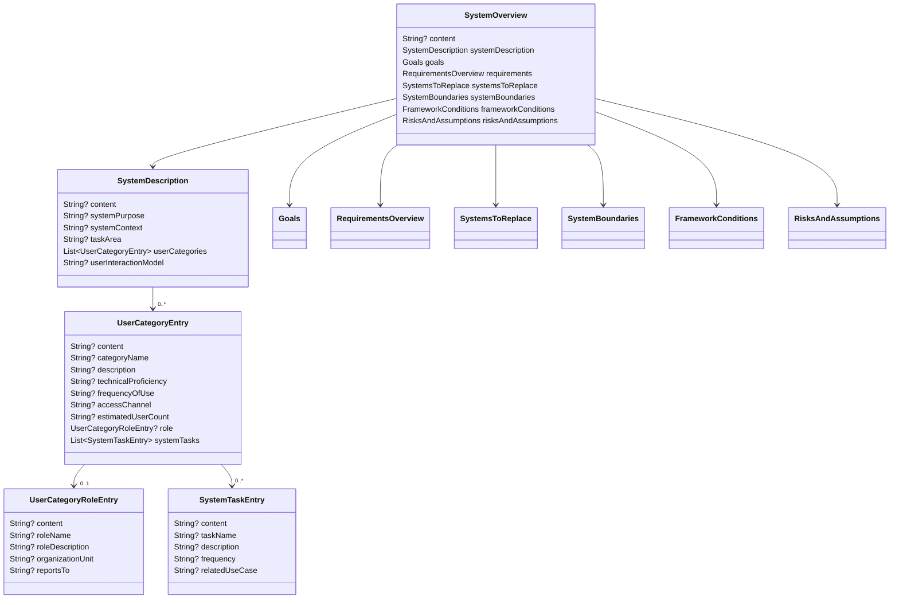

### 6a. Goals

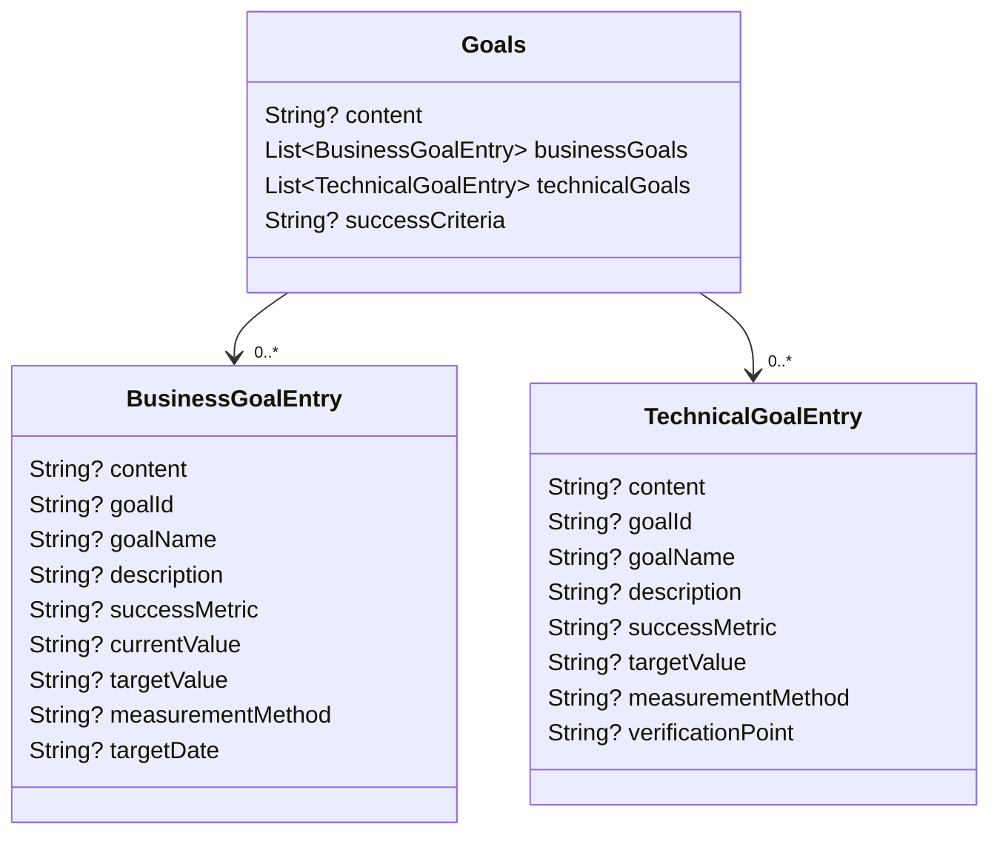

### 6b. Requirements Overview

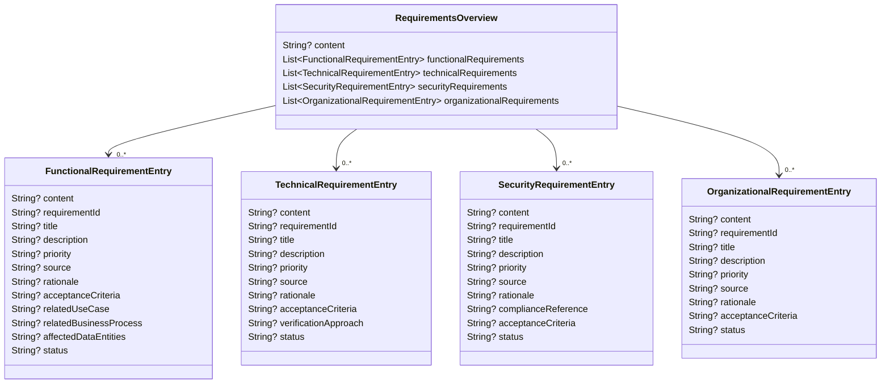

### 6c. Systems to Replace, Boundaries, Framework Conditions, Risks

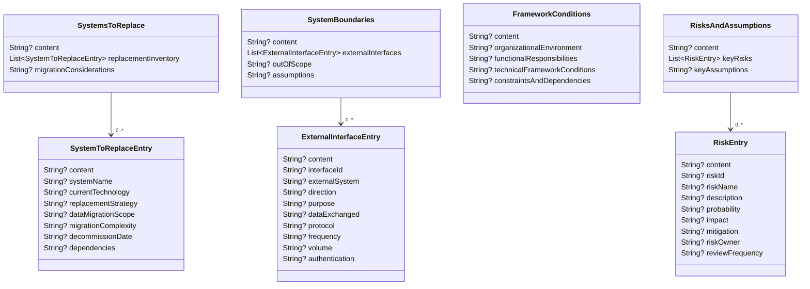

## 7. Section 5 — Organizational Framework [PD00-ORG]

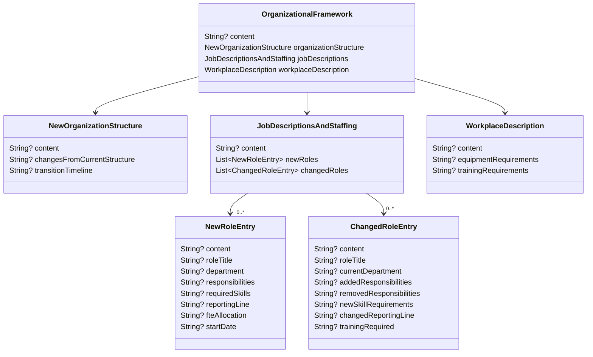

## 8. Section 6 — Target Business Process Model [PD00-TAR]

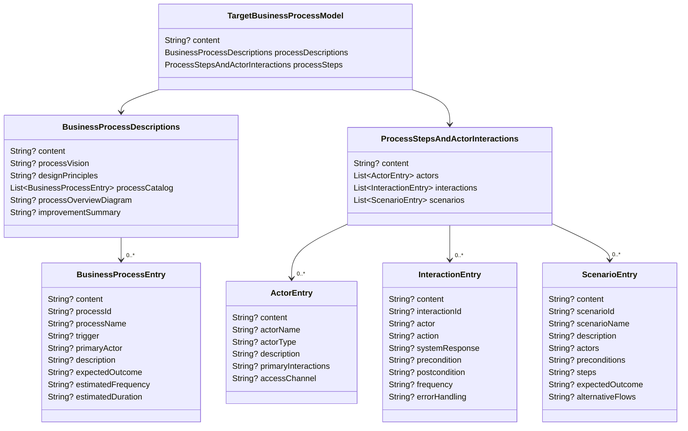

## 9. Section 7 — Business Object and Data Model [PD00-BUS]

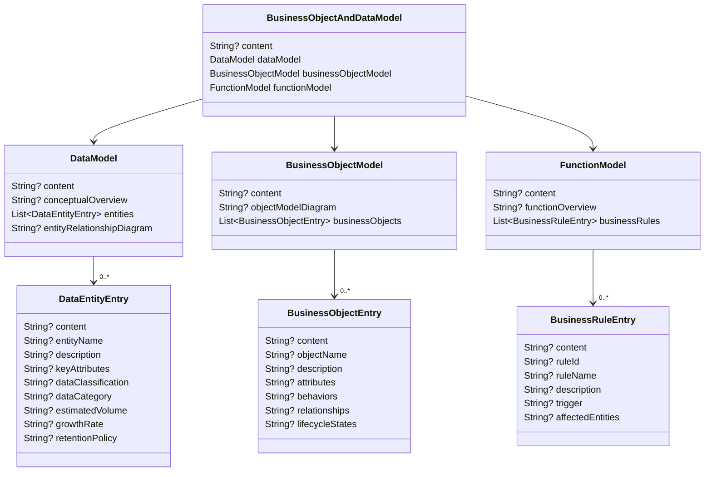

## 10. Section 8 — Technical Framework Concept [PD00-TEC]

```mermaid
classDiagram
    class TechnicalFrameworkConcept {
        String? content
        BasicTechnicalRequirements basicRequirements
        SoftwareDesignRequirements softwareDesign
        StandardSoftwareRequirements standardSoftware
        HardwareRequirements hardware
        OperationsRequirements operations
        CommunicationRequirements communication
        SystemOperationAndMonitoring systemOperation
        TechnicalSecurityRequirements security
    }

    class BasicTechnicalRequirements {
        String? content
        String? platformAndLanguage
        String? architectureStyle
        String? designPatternsAndStandards
    }

    class SoftwareDesignRequirements {
        String? content
        String? layeringAndModuleStructure
        String? developmentEnvironment
        String? reusableComponents
    }

    class StandardSoftwareRequirements {
        String? content
        String? compatibilityRequirements
        String? standardsCompliance
    }

    class HardwareRequirements {
        String? content
        String? serverRequirements
        String? clientRequirements
        String? networkRequirements
    }

    class OperationsRequirements {
        String? content
        String? backupAndRecovery
        String? deploymentStrategy
        String? monitoringAndAlerting
        String? maintenanceWindows
    }

    class CommunicationRequirements {
        String? content
        String? protocolsAndStandards
        String? externalConnectivity
    }

    class SystemOperationAndMonitoring {
        String? content
        String? administrationRequirements
        String? healthChecksAndDiagnostics
        String? capacityPlanning
    }

    class TechnicalSecurityRequirements {
        String? content
        String? itSecurityStandards
        String? dataProtectionAndPrivacy
        String? securityAuditRequirements
    }

    TechnicalFrameworkConcept --> BasicTechnicalRequirements
    TechnicalFrameworkConcept --> SoftwareDesignRequirements
    TechnicalFrameworkConcept --> StandardSoftwareRequirements
    TechnicalFrameworkConcept --> HardwareRequirements
    TechnicalFrameworkConcept --> OperationsRequirements
    TechnicalFrameworkConcept --> CommunicationRequirements
    TechnicalFrameworkConcept --> SystemOperationAndMonitoring
    TechnicalFrameworkConcept --> TechnicalSecurityRequirements
```

## 11. Section 9 — Access and Authorization Concept [PD00-ACC]

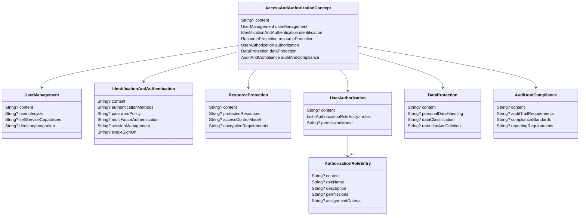

## 12. Section 10 — User Interface Design [PD00-USE]

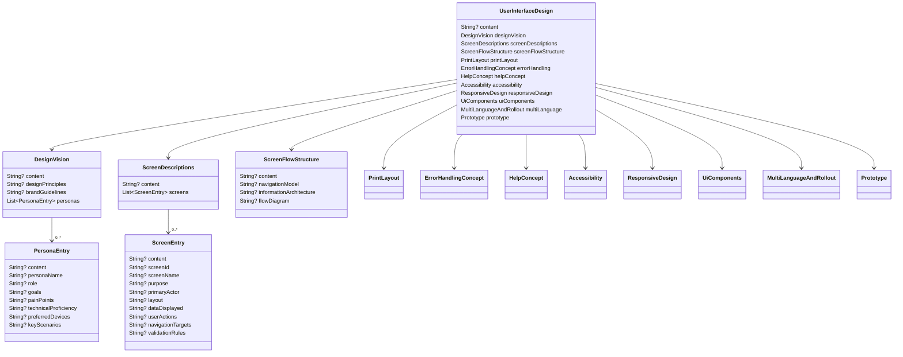

### 12a. UI subsections (continued)

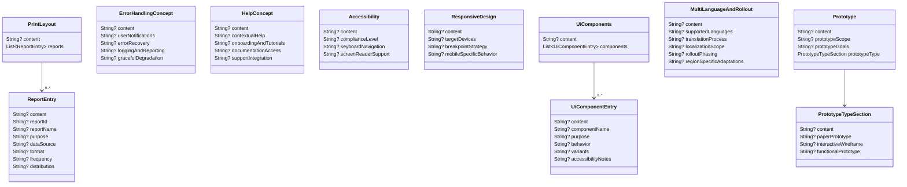

## 13. Section 11 — System Quality Goals [PD00-SYQ]

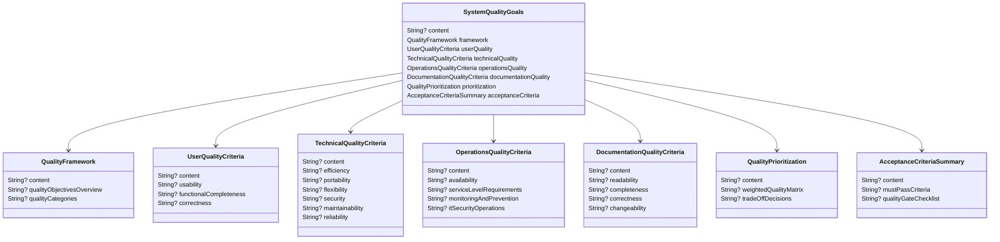

## 14. Section 12 — Components to Use [PD00-COM]

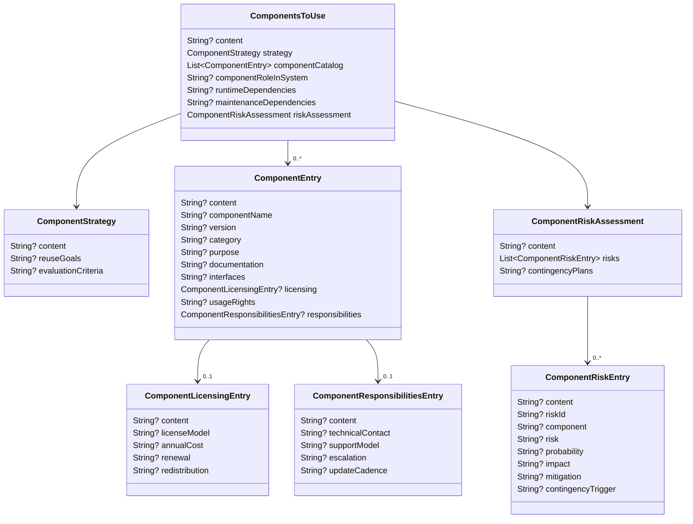

## 15. Section 13 — System Stage Plan [PD00-SSP]

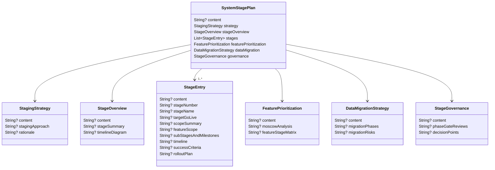

## 16. Section 14 — Delivery Scope and Acceptance [PD00-DEL]

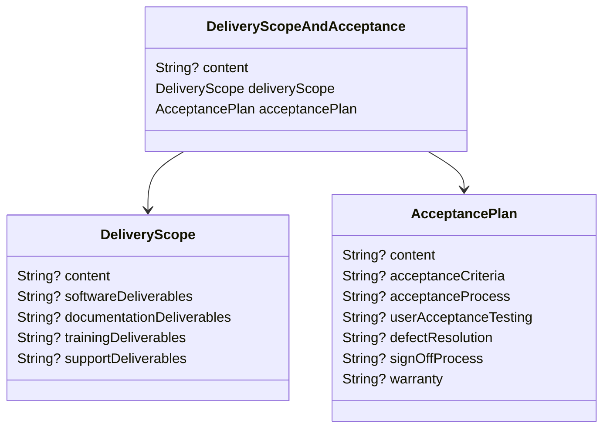

---

## Model Statistics

| Metric | Count |
|--------|-------|
| Total classes | 117 |
| Total enums | 1 (`SectionType`) |
| Entry types (repeatable) | ~30 |
| Section files | 14 |
| Common files | 3 |
| All annotated with `@tomReflector` | Yes |
