# Project Definition — Document Object Model

Class diagrams for the `tom_specs_model` package. All classes are annotated with
`@tomReflector`. Every class carries a `content: String?` field for free-form
narrative text. Scalar form-entry fields are `String?`, plural fields are
`List<String>` or wrapper classes (content + `List<EntryType>` items).

---

## 1. Top-Level Structure

```mermaid
classDiagram
    class ProjectDefinition {
        DocumentHeader header
        CurrentStateAnalysis currentStateAnalysis
        ProjectOrganizationAndProcess projectOrganizationProcess
        Administrative administrative
        SystemOverview systemOverview
        OrganizationalFramework organizationalFramework
        TargetBusinessProcessModel targetBusinessProcess
        BusinessObjectAndDataModel businessDataModel
        TechnicalFrameworkConcept technicalFramework
        AccessAndAuthorizationConcept accessAuthorization
        UserInterfaceDesign userInterfaceDesign
        SystemQualityGoals systemQualityGoals
        ComponentsToUse componentsToUse
        SystemStagePlan systemStagePlan
        DeliveryScopeAndAcceptance deliveryAcceptance
    }

    ProjectDefinition --> DocumentHeader
    ProjectDefinition --> CurrentStateAnalysis : §1
    ProjectDefinition --> ProjectOrganizationAndProcess : §2
    ProjectDefinition --> Administrative : §3
    ProjectDefinition --> SystemOverview : §4
    ProjectDefinition --> OrganizationalFramework : §5
    ProjectDefinition --> TargetBusinessProcessModel : §6
    ProjectDefinition --> BusinessObjectAndDataModel : §7
    ProjectDefinition --> TechnicalFrameworkConcept : §8
    ProjectDefinition --> AccessAndAuthorizationConcept : §9
    ProjectDefinition --> UserInterfaceDesign : §10
    ProjectDefinition --> SystemQualityGoals : §11
    ProjectDefinition --> ComponentsToUse : §12
    ProjectDefinition --> SystemStagePlan : §13
    ProjectDefinition --> DeliveryScopeAndAcceptance : §14
```

## 2. Common Types

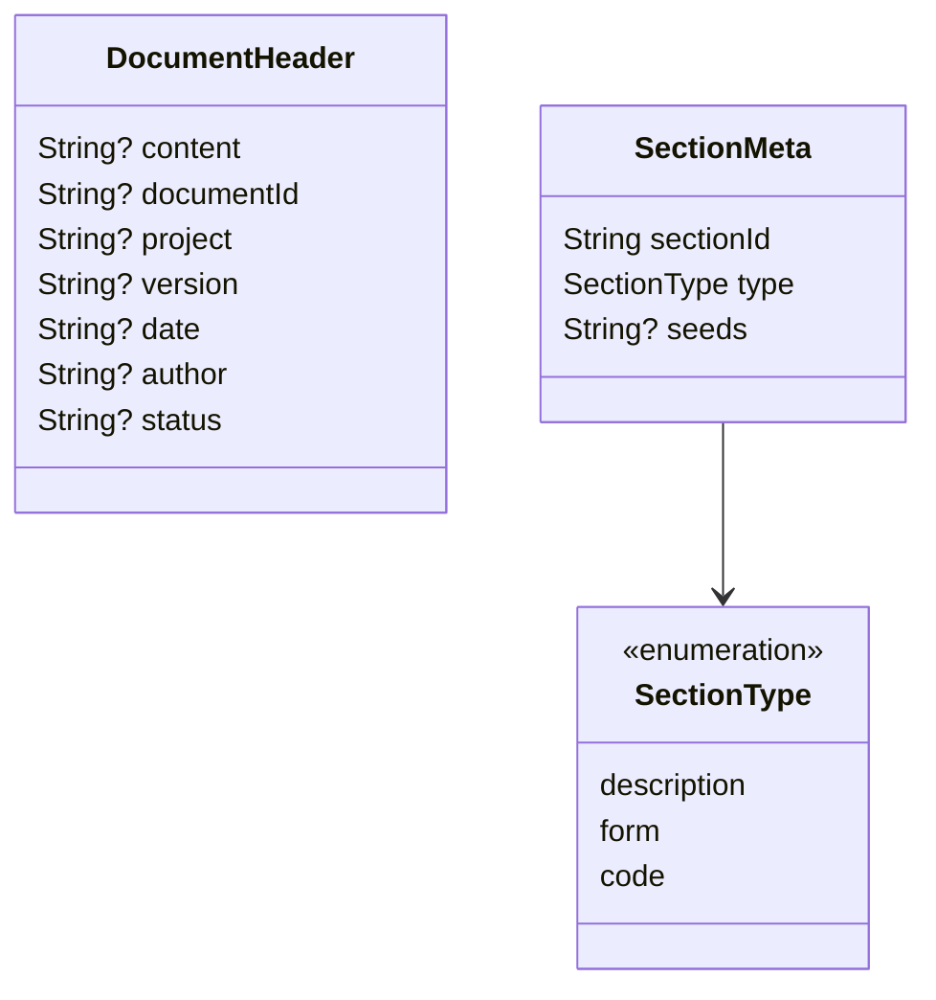
```mermaid
classDiagram
    class DocumentHeader {
        String? content
        String? documentId
        String? project
        String? version
        String? date
        String? author
        String? status
    }

    class SectionMeta {
        String sectionId
        SectionType type
        String? seeds
    }

    class SectionType {
        <<enumeration>>
        description
        form
        code
    }

    SectionMeta --> SectionType
```

## 3. Section 1 — Current State Analysis [PD00-CUR]

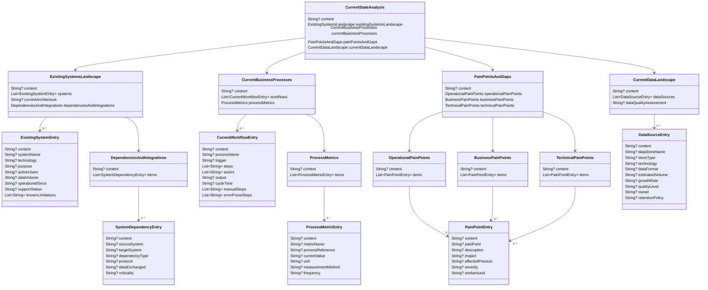
```mermaid
classDiagram
    class CurrentStateAnalysis {
        String? content
        ExistingSystemsLandscape existingSystemsLandscape
        CurrentBusinessProcesses currentBusinessProcesses
        PainPointsAndGaps painPointsAndGaps
        CurrentDataLandscape currentDataLandscape
    }

    class ExistingSystemsLandscape {
        String? content
        List~ExistingSystemEntry~ systems
        String? currentArchitecture
        DependenciesAndIntegrations dependenciesAndIntegrations
    }

    class ExistingSystemEntry {
        String? content
        String? systemName
        String? technology
        String? purpose
        String? activeUsers
        String? dataVolume
        String? operationalSince
        String? supportStatus
        List~String~ knownLimitations
    }

    class DependenciesAndIntegrations {
        String? content
        List~SystemDependencyEntry~ items
    }

    class SystemDependencyEntry {
        String? content
        String? sourceSystem
        String? targetSystem
        String? dependencyType
        String? protocol
        String? dataExchanged
        String? criticality
    }

    class CurrentBusinessProcesses {
        String? content
        List~CurrentWorkflowEntry~ workflows
        ProcessMetrics processMetrics
    }

    class CurrentWorkflowEntry {
        String? content
        String? processName
        String? trigger
        List~String~ steps
        List~String~ actors
        String? output
        String? cycleTime
        List~String~ manualSteps
        List~String~ errorProneSteps
    }

    class ProcessMetrics {
        String? content
        List~ProcessMetricEntry~ items
    }

    class ProcessMetricEntry {
        String? content
        String? metricName
        String? processReference
        String? currentValue
        String? unit
        String? measurementMethod
        String? frequency
    }

    class PainPointsAndGaps {
        String? content
        OperationalPainPoints operationalPainPoints
        BusinessPainPoints businessPainPoints
        TechnicalPainPoints technicalPainPoints
    }

    class OperationalPainPoints {
        String? content
        List~PainPointEntry~ items
    }

    class BusinessPainPoints {
        String? content
        List~PainPointEntry~ items
    }

    class TechnicalPainPoints {
        String? content
        List~PainPointEntry~ items
    }

    class PainPointEntry {
        String? content
        String? painPoint
        String? description
        String? impact
        String? affectedProcess
        String? severity
        String? workaround
    }

    class CurrentDataLandscape {
        String? content
        List~DataSourceEntry~ dataSources
        String? dataQualityAssessment
    }

    class DataSourceEntry {
        String? content
        String? dataStoreName
        String? storeType
        String? technology
        String? dataFormat
        String? estimatedVolume
        String? growthRate
        String? qualityLevel
        String? owner
        String? retentionPolicy
    }

    CurrentStateAnalysis --> ExistingSystemsLandscape
    CurrentStateAnalysis --> CurrentBusinessProcesses
    CurrentStateAnalysis --> PainPointsAndGaps
    CurrentStateAnalysis --> CurrentDataLandscape
    ExistingSystemsLandscape --> "0..*" ExistingSystemEntry
    ExistingSystemsLandscape --> DependenciesAndIntegrations
    DependenciesAndIntegrations --> "0..*" SystemDependencyEntry
    CurrentBusinessProcesses --> "0..*" CurrentWorkflowEntry
    CurrentBusinessProcesses --> ProcessMetrics
    ProcessMetrics --> "0..*" ProcessMetricEntry
    PainPointsAndGaps --> OperationalPainPoints
    PainPointsAndGaps --> BusinessPainPoints
    PainPointsAndGaps --> TechnicalPainPoints
    OperationalPainPoints --> "0..*" PainPointEntry
    BusinessPainPoints --> "0..*" PainPointEntry
    TechnicalPainPoints --> "0..*" PainPointEntry
    CurrentDataLandscape --> "0..*" DataSourceEntry
```

## 4. Section 2 — Project Organization and Process [PD00-POP]

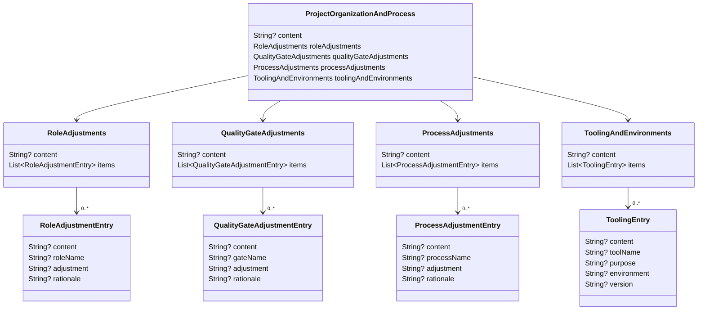
```mermaid
classDiagram
    class ProjectOrganizationAndProcess {
        String? content
        RoleAdjustments roleAdjustments
        QualityGateAdjustments qualityGateAdjustments
        ProcessAdjustments processAdjustments
        ToolingAndEnvironments toolingAndEnvironments
    }

    class RoleAdjustments {
        String? content
        List~RoleAdjustmentEntry~ items
    }

    class RoleAdjustmentEntry {
        String? content
        String? roleName
        String? adjustment
        String? rationale
    }

    class QualityGateAdjustments {
        String? content
        List~QualityGateAdjustmentEntry~ items
    }

    class QualityGateAdjustmentEntry {
        String? content
        String? gateName
        String? adjustment
        String? rationale
    }

    class ProcessAdjustments {
        String? content
        List~ProcessAdjustmentEntry~ items
    }

    class ProcessAdjustmentEntry {
        String? content
        String? processName
        String? adjustment
        String? rationale
    }

    class ToolingAndEnvironments {
        String? content
        List~ToolingEntry~ items
    }

    class ToolingEntry {
        String? content
        String? toolName
        String? purpose
        String? environment
        String? version
    }

    ProjectOrganizationAndProcess --> RoleAdjustments
    ProjectOrganizationAndProcess --> QualityGateAdjustments
    ProjectOrganizationAndProcess --> ProcessAdjustments
    ProjectOrganizationAndProcess --> ToolingAndEnvironments
    RoleAdjustments --> "0..*" RoleAdjustmentEntry
    QualityGateAdjustments --> "0..*" QualityGateAdjustmentEntry
    ProcessAdjustments --> "0..*" ProcessAdjustmentEntry
    ToolingAndEnvironments --> "0..*" ToolingEntry
```

## 5. Section 3 — Administrative [PD00-ADM]

```mermaid
classDiagram
    class Administrative {
        String? content
        ProjectOrganization projectOrganization
        ProjectTeamStaffing projectTeamStaffing
        DistributionList distributionList
        ChangeProcedure changeProcedure
        ReferenceDocuments referenceDocuments
        String? otherAdministrative
    }

    class ProjectOrganization {
        String? content
        OrganizationStructure organizationStructure
        List~CommitteeMemberEntry~ steeringCommittee
    }

    class OrganizationStructure {
        String? content
        String? orgChartExplanation
        String? orgChartDiagram
    }

    class CommitteeMemberEntry {
        String? content
        String? name
        String? organizationRole
        String? committeeRole
        String? decisionAuthority
        String? meetingAttendance
    }

    class ProjectTeamStaffing {
        String? content
        List~TeamMemberEntry~ members
    }

    class TeamMemberEntry {
        String? content
        String? name
        String? projectRole
        String? organization
        String? allocation
        String? startDate
        String? endDate
        String? specialSkills
        String? reportingTo
    }

    class DistributionList {
        String? content
        FullDistribution fullDistribution
        ExecutiveSummaryDistribution executiveSummary
    }

    class FullDistribution {
        String? content
        List~DistributionRecipientEntry~ items
    }

    class ExecutiveSummaryDistribution {
        String? content
        List~DistributionRecipientEntry~ items
    }

    class DistributionRecipientEntry {
        String? content
        String? name
        String? role
        String? organization
        String? distributionMethod
    }

    class ChangeProcedure {
        String? content
        ChangeProcess changeProcess
        ChangeImpactCriteria changeImpactCriteria
    }

    class ChangeProcess {
        String? content
        String? overviewDiagram
        List~ChangeStepEntry~ steps
        List~String~ roles
        String? approvalAuthority
        String? escalationPath
    }

    class ChangeStepEntry {
        String? content
        String? stepName
        String? description
        String? responsibleRole
        String? inputArtifacts
        String? outputArtifacts
        String? approvalCriteria
        String? subflowDiagram
    }

    class ChangeImpactCriteria {
        String? content
        List~ChangeImpactCriterionEntry~ items
    }

    class ChangeImpactCriterionEntry {
        String? content
        String? criterion
        String? impactLevel
        String? description
        String? approvalRequired
    }

    class ReferenceDocuments {
        String? content
        List~ReferenceDocumentEntry~ documents
    }

    class ReferenceDocumentEntry {
        String? content
        String? documentTitle
        String? version
        String? author
        String? date
        String? purpose
        String? location
    }

    Administrative --> ProjectOrganization
    Administrative --> ProjectTeamStaffing
    Administrative --> DistributionList
    Administrative --> ChangeProcedure
    Administrative --> ReferenceDocuments
    ProjectOrganization --> OrganizationStructure
    ProjectOrganization --> "0..*" CommitteeMemberEntry
    ProjectTeamStaffing --> "0..*" TeamMemberEntry
    DistributionList --> FullDistribution
    DistributionList --> ExecutiveSummaryDistribution
    FullDistribution --> "0..*" DistributionRecipientEntry
    ExecutiveSummaryDistribution --> "0..*" DistributionRecipientEntry
    ChangeProcedure --> ChangeProcess
    ChangeProcedure --> ChangeImpactCriteria
    ChangeProcess --> "0..*" ChangeStepEntry
    ChangeImpactCriteria --> "0..*" ChangeImpactCriterionEntry
    ReferenceDocuments --> "0..*" ReferenceDocumentEntry
```

## 6. Section 4 — System Overview [PD00-SYO]

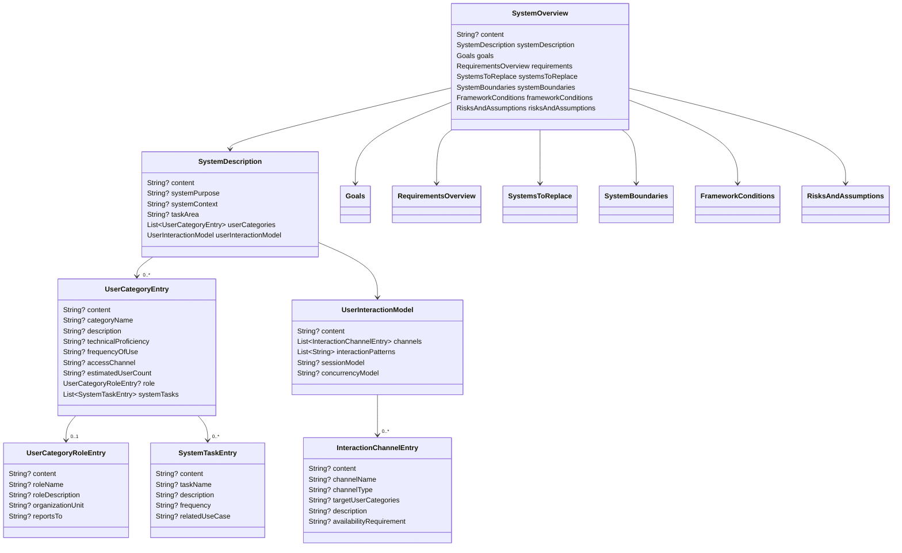
```mermaid
classDiagram
    class SystemOverview {
        String? content
        SystemDescription systemDescription
        Goals goals
        RequirementsOverview requirements
        SystemsToReplace systemsToReplace
        SystemBoundaries systemBoundaries
        FrameworkConditions frameworkConditions
        RisksAndAssumptions risksAndAssumptions
    }

    class SystemDescription {
        String? content
        String? systemPurpose
        String? systemContext
        String? taskArea
        List~UserCategoryEntry~ userCategories
        UserInteractionModel userInteractionModel
    }

    class UserInteractionModel {
        String? content
        List~InteractionChannelEntry~ channels
        List~String~ interactionPatterns
        String? sessionModel
        String? concurrencyModel
    }

    class InteractionChannelEntry {
        String? content
        String? channelName
        String? channelType
        String? targetUserCategories
        String? description
        String? availabilityRequirement
    }

    class UserCategoryEntry {
        String? content
        String? categoryName
        String? description
        String? technicalProficiency
        String? frequencyOfUse
        String? accessChannel
        String? estimatedUserCount
        UserCategoryRoleEntry? role
        List~SystemTaskEntry~ systemTasks
    }

    class UserCategoryRoleEntry {
        String? content
        String? roleName
        String? roleDescription
        String? organizationUnit
        String? reportsTo
    }

    class SystemTaskEntry {
        String? content
        String? taskName
        String? description
        String? frequency
        String? relatedUseCase
    }

    SystemOverview --> SystemDescription
    SystemOverview --> Goals
    SystemOverview --> RequirementsOverview
    SystemOverview --> SystemsToReplace
    SystemOverview --> SystemBoundaries
    SystemOverview --> FrameworkConditions
    SystemOverview --> RisksAndAssumptions
    SystemDescription --> "0..*" UserCategoryEntry
    SystemDescription --> UserInteractionModel
    UserInteractionModel --> "0..*" InteractionChannelEntry
    UserCategoryEntry --> "0..1" UserCategoryRoleEntry
    UserCategoryEntry --> "0..*" SystemTaskEntry
```

### 6a. Goals

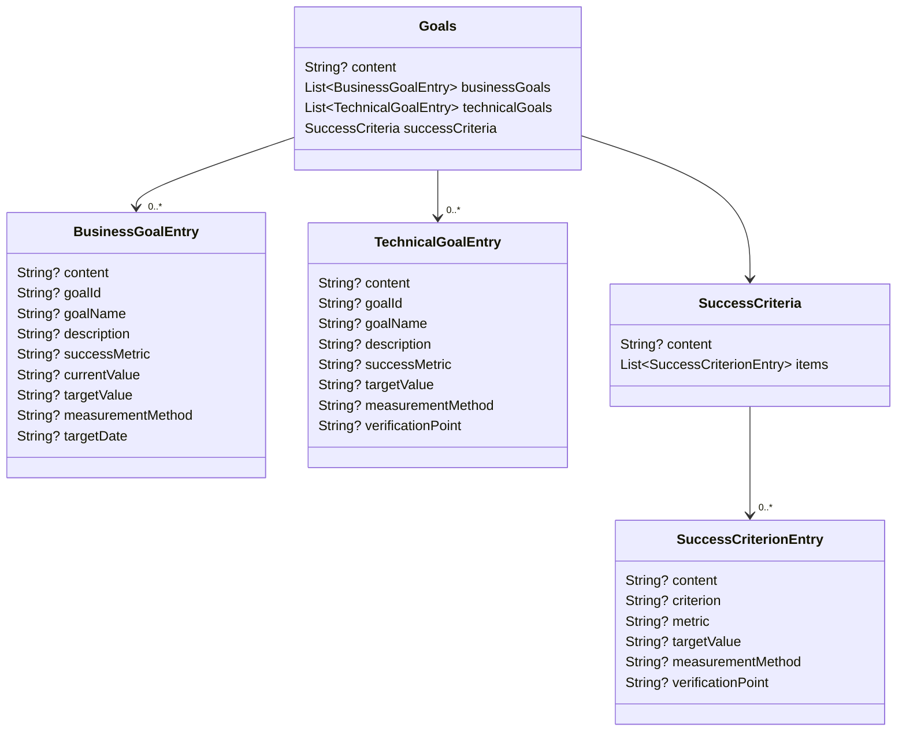
```mermaid
classDiagram
    class Goals {
        String? content
        List~BusinessGoalEntry~ businessGoals
        List~TechnicalGoalEntry~ technicalGoals
        SuccessCriteria successCriteria
    }

    class BusinessGoalEntry {
        String? content
        String? goalId
        String? goalName
        String? description
        String? successMetric
        String? currentValue
        String? targetValue
        String? measurementMethod
        String? targetDate
    }

    class TechnicalGoalEntry {
        String? content
        String? goalId
        String? goalName
        String? description
        String? successMetric
        String? targetValue
        String? measurementMethod
        String? verificationPoint
    }

    class SuccessCriteria {
        String? content
        List~SuccessCriterionEntry~ items
    }

    class SuccessCriterionEntry {
        String? content
        String? criterion
        String? metric
        String? targetValue
        String? measurementMethod
        String? verificationPoint
    }

    Goals --> "0..*" BusinessGoalEntry
    Goals --> "0..*" TechnicalGoalEntry
    Goals --> SuccessCriteria
    SuccessCriteria --> "0..*" SuccessCriterionEntry
```

### 6b. Requirements Overview

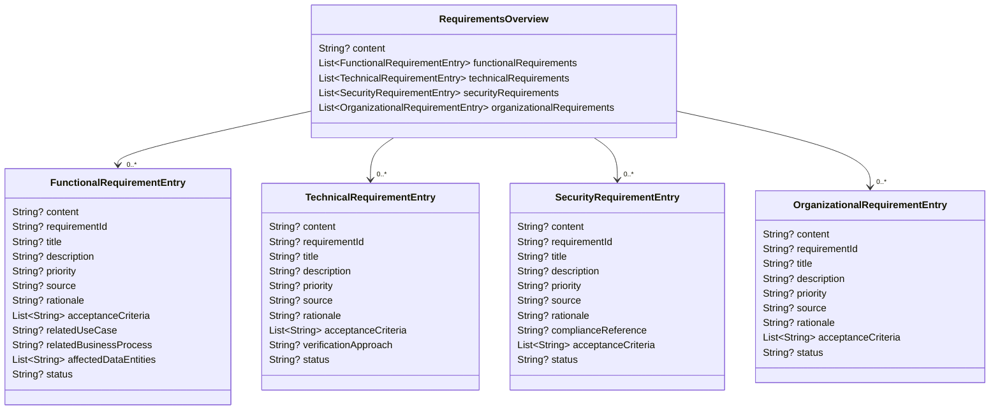
```mermaid
classDiagram
    class RequirementsOverview {
        String? content
        List~FunctionalRequirementEntry~ functionalRequirements
        List~TechnicalRequirementEntry~ technicalRequirements
        List~SecurityRequirementEntry~ securityRequirements
        List~OrganizationalRequirementEntry~ organizationalRequirements
    }

    class FunctionalRequirementEntry {
        String? content
        String? requirementId
        String? title
        String? description
        String? priority
        String? source
        String? rationale
        List~String~ acceptanceCriteria
        String? relatedUseCase
        String? relatedBusinessProcess
        List~String~ affectedDataEntities
        String? status
    }

    class TechnicalRequirementEntry {
        String? content
        String? requirementId
        String? title
        String? description
        String? priority
        String? source
        String? rationale
        List~String~ acceptanceCriteria
        String? verificationApproach
        String? status
    }

    class SecurityRequirementEntry {
        String? content
        String? requirementId
        String? title
        String? description
        String? priority
        String? source
        String? rationale
        String? complianceReference
        List~String~ acceptanceCriteria
        String? status
    }

    class OrganizationalRequirementEntry {
        String? content
        String? requirementId
        String? title
        String? description
        String? priority
        String? source
        String? rationale
        List~String~ acceptanceCriteria
        String? status
    }

    RequirementsOverview --> "0..*" FunctionalRequirementEntry
    RequirementsOverview --> "0..*" TechnicalRequirementEntry
    RequirementsOverview --> "0..*" SecurityRequirementEntry
    RequirementsOverview --> "0..*" OrganizationalRequirementEntry
```

### 6c. Systems to Replace & Migration

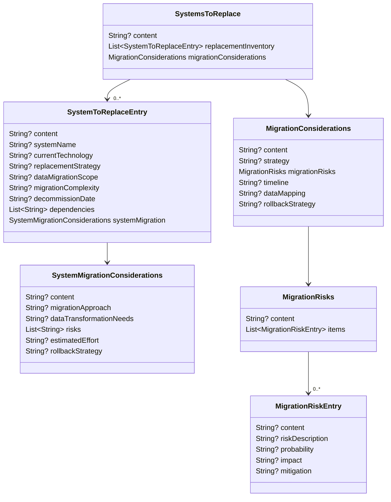
```mermaid
classDiagram
    class SystemsToReplace {
        String? content
        List~SystemToReplaceEntry~ replacementInventory
        MigrationConsiderations migrationConsiderations
    }

    class SystemToReplaceEntry {
        String? content
        String? systemName
        String? currentTechnology
        String? replacementStrategy
        String? dataMigrationScope
        String? migrationComplexity
        String? decommissionDate
        List~String~ dependencies
        SystemMigrationConsiderations systemMigration
    }

    class SystemMigrationConsiderations {
        String? content
        String? migrationApproach
        String? dataTransformationNeeds
        List~String~ risks
        String? estimatedEffort
        String? rollbackStrategy
    }

    class MigrationConsiderations {
        String? content
        String? strategy
        MigrationRisks migrationRisks
        String? timeline
        String? dataMapping
        String? rollbackStrategy
    }

    class MigrationRisks {
        String? content
        List~MigrationRiskEntry~ items
    }

    class MigrationRiskEntry {
        String? content
        String? riskDescription
        String? probability
        String? impact
        String? mitigation
    }

    SystemsToReplace --> "0..*" SystemToReplaceEntry
    SystemsToReplace --> MigrationConsiderations
    SystemToReplaceEntry --> SystemMigrationConsiderations
    MigrationConsiderations --> MigrationRisks
    MigrationRisks --> "0..*" MigrationRiskEntry
```

### 6d. System Boundaries

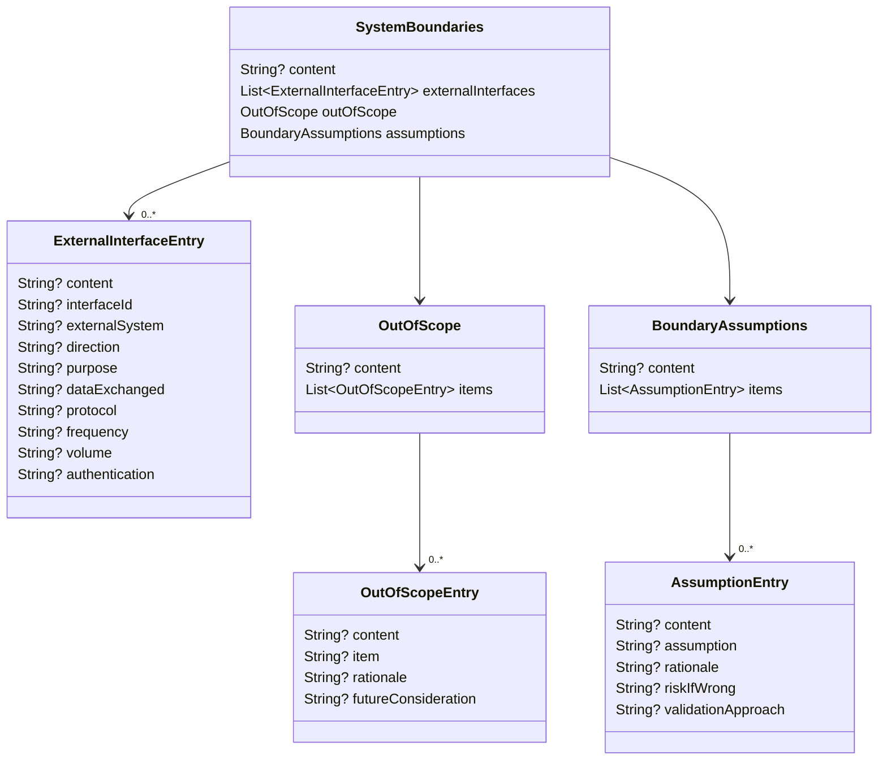
```mermaid
classDiagram
    class SystemBoundaries {
        String? content
        List~ExternalInterfaceEntry~ externalInterfaces
        OutOfScope outOfScope
        BoundaryAssumptions assumptions
    }

    class ExternalInterfaceEntry {
        String? content
        String? interfaceId
        String? externalSystem
        String? direction
        String? purpose
        String? dataExchanged
        String? protocol
        String? frequency
        String? volume
        String? authentication
    }

    class OutOfScope {
        String? content
        List~OutOfScopeEntry~ items
    }

    class OutOfScopeEntry {
        String? content
        String? item
        String? rationale
        String? futureConsideration
    }

    class BoundaryAssumptions {
        String? content
        List~AssumptionEntry~ items
    }

    class AssumptionEntry {
        String? content
        String? assumption
        String? rationale
        String? riskIfWrong
        String? validationApproach
    }

    SystemBoundaries --> "0..*" ExternalInterfaceEntry
    SystemBoundaries --> OutOfScope
    SystemBoundaries --> BoundaryAssumptions
    OutOfScope --> "0..*" OutOfScopeEntry
    BoundaryAssumptions --> "0..*" AssumptionEntry
```

### 6e. Framework Conditions

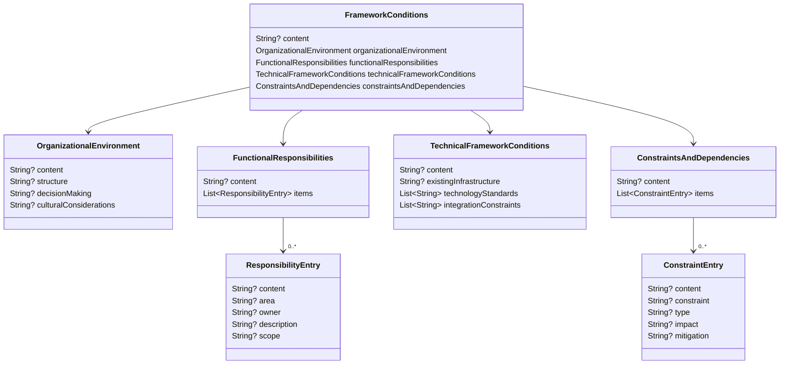
```mermaid
classDiagram
    class FrameworkConditions {
        String? content
        OrganizationalEnvironment organizationalEnvironment
        FunctionalResponsibilities functionalResponsibilities
        TechnicalFrameworkConditions technicalFrameworkConditions
        ConstraintsAndDependencies constraintsAndDependencies
    }

    class OrganizationalEnvironment {
        String? content
        String? structure
        String? decisionMaking
        String? culturalConsiderations
    }

    class FunctionalResponsibilities {
        String? content
        List~ResponsibilityEntry~ items
    }

    class ResponsibilityEntry {
        String? content
        String? area
        String? owner
        String? description
        String? scope
    }

    class TechnicalFrameworkConditions {
        String? content
        String? existingInfrastructure
        List~String~ technologyStandards
        List~String~ integrationConstraints
    }

    class ConstraintsAndDependencies {
        String? content
        List~ConstraintEntry~ items
    }

    class ConstraintEntry {
        String? content
        String? constraint
        String? type
        String? impact
        String? mitigation
    }

    FrameworkConditions --> OrganizationalEnvironment
    FrameworkConditions --> FunctionalResponsibilities
    FrameworkConditions --> TechnicalFrameworkConditions
    FrameworkConditions --> ConstraintsAndDependencies
    FunctionalResponsibilities --> "0..*" ResponsibilityEntry
    ConstraintsAndDependencies --> "0..*" ConstraintEntry
```

### 6f. Risks and Assumptions

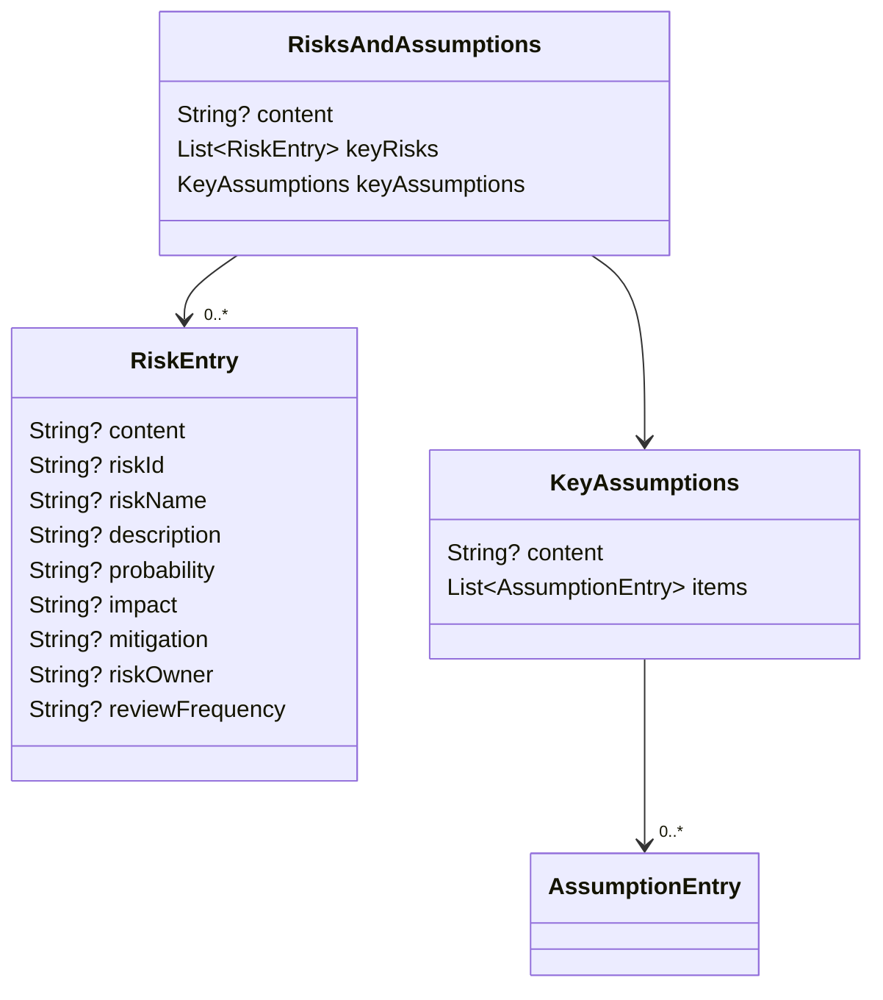
```mermaid
classDiagram
    class RisksAndAssumptions {
        String? content
        List~RiskEntry~ keyRisks
        KeyAssumptions keyAssumptions
    }

    class RiskEntry {
        String? content
        String? riskId
        String? riskName
        String? description
        String? probability
        String? impact
        String? mitigation
        String? riskOwner
        String? reviewFrequency
    }

    class KeyAssumptions {
        String? content
        List~AssumptionEntry~ items
    }

    RisksAndAssumptions --> "0..*" RiskEntry
    RisksAndAssumptions --> KeyAssumptions
    KeyAssumptions --> "0..*" AssumptionEntry
```

## 7. Section 5 — Organizational Framework [PD00-ORG]

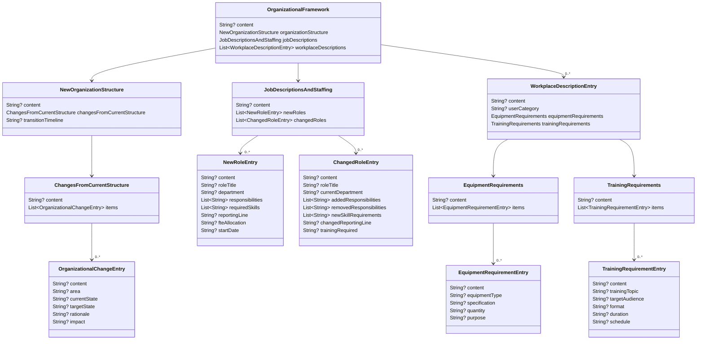
```mermaid
classDiagram
    class OrganizationalFramework {
        String? content
        NewOrganizationStructure organizationStructure
        JobDescriptionsAndStaffing jobDescriptions
        List~WorkplaceDescriptionEntry~ workplaceDescriptions
    }

    class NewOrganizationStructure {
        String? content
        ChangesFromCurrentStructure changesFromCurrentStructure
        String? transitionTimeline
    }

    class ChangesFromCurrentStructure {
        String? content
        List~OrganizationalChangeEntry~ items
    }

    class OrganizationalChangeEntry {
        String? content
        String? area
        String? currentState
        String? targetState
        String? rationale
        String? impact
    }

    class JobDescriptionsAndStaffing {
        String? content
        List~NewRoleEntry~ newRoles
        List~ChangedRoleEntry~ changedRoles
    }

    class NewRoleEntry {
        String? content
        String? roleTitle
        String? department
        List~String~ responsibilities
        List~String~ requiredSkills
        String? reportingLine
        String? fteAllocation
        String? startDate
    }

    class ChangedRoleEntry {
        String? content
        String? roleTitle
        String? currentDepartment
        List~String~ addedResponsibilities
        List~String~ removedResponsibilities
        List~String~ newSkillRequirements
        String? changedReportingLine
        String? trainingRequired
    }

    class WorkplaceDescriptionEntry {
        String? content
        String? userCategory
        EquipmentRequirements equipmentRequirements
        TrainingRequirements trainingRequirements
    }

    class EquipmentRequirements {
        String? content
        List~EquipmentRequirementEntry~ items
    }

    class EquipmentRequirementEntry {
        String? content
        String? equipmentType
        String? specification
        String? quantity
        String? purpose
    }

    class TrainingRequirements {
        String? content
        List~TrainingRequirementEntry~ items
    }

    class TrainingRequirementEntry {
        String? content
        String? trainingTopic
        String? targetAudience
        String? format
        String? duration
        String? schedule
    }

    OrganizationalFramework --> NewOrganizationStructure
    OrganizationalFramework --> JobDescriptionsAndStaffing
    OrganizationalFramework --> "0..*" WorkplaceDescriptionEntry
    NewOrganizationStructure --> ChangesFromCurrentStructure
    ChangesFromCurrentStructure --> "0..*" OrganizationalChangeEntry
    JobDescriptionsAndStaffing --> "0..*" NewRoleEntry
    JobDescriptionsAndStaffing --> "0..*" ChangedRoleEntry
    WorkplaceDescriptionEntry --> EquipmentRequirements
    WorkplaceDescriptionEntry --> TrainingRequirements
    EquipmentRequirements --> "0..*" EquipmentRequirementEntry
    TrainingRequirements --> "0..*" TrainingRequirementEntry
```

## 8. Section 6 — Target Business Process Model [PD00-TAR]

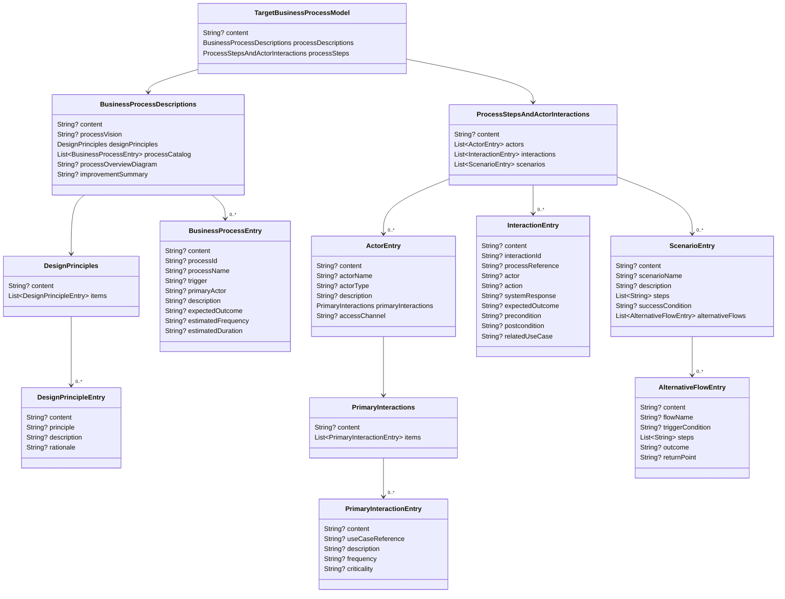
```mermaid
classDiagram
    class TargetBusinessProcessModel {
        String? content
        BusinessProcessDescriptions processDescriptions
        ProcessStepsAndActorInteractions processSteps
    }

    class BusinessProcessDescriptions {
        String? content
        String? processVision
        DesignPrinciples designPrinciples
        List~BusinessProcessEntry~ processCatalog
        String? processOverviewDiagram
        String? improvementSummary
    }

    class DesignPrinciples {
        String? content
        List~DesignPrincipleEntry~ items
    }

    class DesignPrincipleEntry {
        String? content
        String? principle
        String? description
        String? rationale
    }

    class BusinessProcessEntry {
        String? content
        String? processId
        String? processName
        String? trigger
        String? primaryActor
        String? description
        String? expectedOutcome
        String? estimatedFrequency
        String? estimatedDuration
    }

    class ProcessStepsAndActorInteractions {
        String? content
        List~ActorEntry~ actors
        List~InteractionEntry~ interactions
        List~ScenarioEntry~ scenarios
    }

    class ActorEntry {
        String? content
        String? actorName
        String? actorType
        String? description
        PrimaryInteractions primaryInteractions
        String? accessChannel
    }

    class PrimaryInteractions {
        String? content
        List~PrimaryInteractionEntry~ items
    }

    class PrimaryInteractionEntry {
        String? content
        String? useCaseReference
        String? description
        String? frequency
        String? criticality
    }

    class InteractionEntry {
        String? content
        String? interactionId
        String? processReference
        String? actor
        String? action
        String? systemResponse
        String? expectedOutcome
        String? precondition
        String? postcondition
        String? relatedUseCase
    }

    class ScenarioEntry {
        String? content
        String? scenarioName
        String? description
        List~String~ steps
        String? successCondition
        List~AlternativeFlowEntry~ alternativeFlows
    }

    class AlternativeFlowEntry {
        String? content
        String? flowName
        String? triggerCondition
        List~String~ steps
        String? outcome
        String? returnPoint
    }

    TargetBusinessProcessModel --> BusinessProcessDescriptions
    TargetBusinessProcessModel --> ProcessStepsAndActorInteractions
    BusinessProcessDescriptions --> DesignPrinciples
    BusinessProcessDescriptions --> "0..*" BusinessProcessEntry
    DesignPrinciples --> "0..*" DesignPrincipleEntry
    ProcessStepsAndActorInteractions --> "0..*" ActorEntry
    ProcessStepsAndActorInteractions --> "0..*" InteractionEntry
    ProcessStepsAndActorInteractions --> "0..*" ScenarioEntry
    ActorEntry --> PrimaryInteractions
    PrimaryInteractions --> "0..*" PrimaryInteractionEntry
    ScenarioEntry --> "0..*" AlternativeFlowEntry
```

## 9. Section 7 — Business Object and Data Model [PD00-BUS]

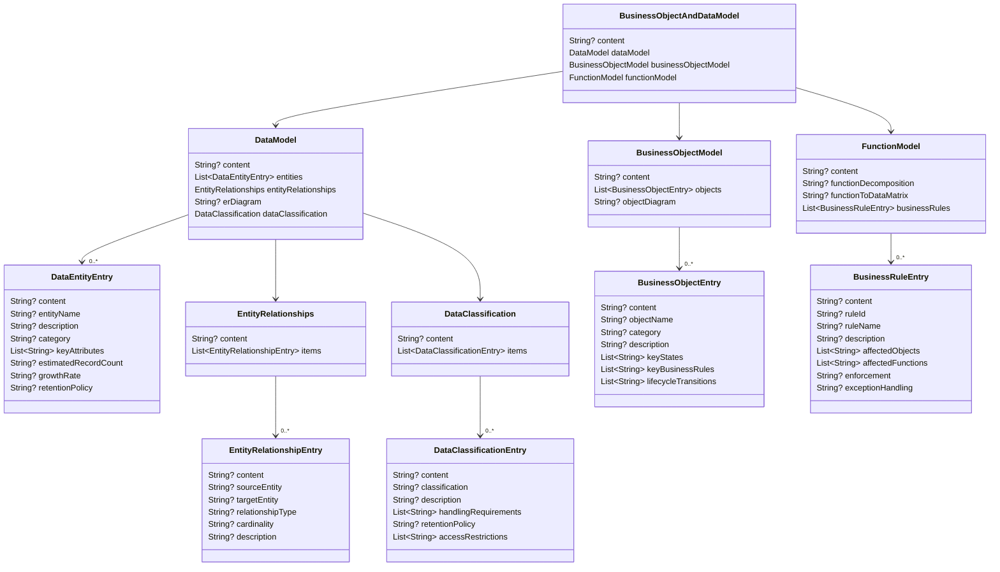
```mermaid
classDiagram
    class BusinessObjectAndDataModel {
        String? content
        DataModel dataModel
        BusinessObjectModel businessObjectModel
        FunctionModel functionModel
    }

    class DataModel {
        String? content
        List~DataEntityEntry~ entities
        EntityRelationships entityRelationships
        String? erDiagram
        DataClassification dataClassification
    }

    class DataEntityEntry {
        String? content
        String? entityName
        String? description
        String? category
        List~String~ keyAttributes
        String? estimatedRecordCount
        String? growthRate
        String? retentionPolicy
    }

    class EntityRelationships {
        String? content
        List~EntityRelationshipEntry~ items
    }

    class EntityRelationshipEntry {
        String? content
        String? sourceEntity
        String? targetEntity
        String? relationshipType
        String? cardinality
        String? description
    }

    class DataClassification {
        String? content
        List~DataClassificationEntry~ items
    }

    class DataClassificationEntry {
        String? content
        String? classification
        String? description
        List~String~ handlingRequirements
        String? retentionPolicy
        List~String~ accessRestrictions
    }

    class BusinessObjectModel {
        String? content
        List~BusinessObjectEntry~ objects
        String? objectDiagram
    }

    class BusinessObjectEntry {
        String? content
        String? objectName
        String? category
        String? description
        List~String~ keyStates
        List~String~ keyBusinessRules
        List~String~ lifecycleTransitions
    }

    class FunctionModel {
        String? content
        String? functionDecomposition
        String? functionToDataMatrix
        List~BusinessRuleEntry~ businessRules
    }

    class BusinessRuleEntry {
        String? content
        String? ruleId
        String? ruleName
        String? description
        List~String~ affectedObjects
        List~String~ affectedFunctions
        String? enforcement
        String? exceptionHandling
    }

    BusinessObjectAndDataModel --> DataModel
    BusinessObjectAndDataModel --> BusinessObjectModel
    BusinessObjectAndDataModel --> FunctionModel
    DataModel --> "0..*" DataEntityEntry
    DataModel --> EntityRelationships
    DataModel --> DataClassification
    EntityRelationships --> "0..*" EntityRelationshipEntry
    DataClassification --> "0..*" DataClassificationEntry
    BusinessObjectModel --> "0..*" BusinessObjectEntry
    FunctionModel --> "0..*" BusinessRuleEntry
```

## 10. Section 8 — Technical Framework [PD00-TEC]

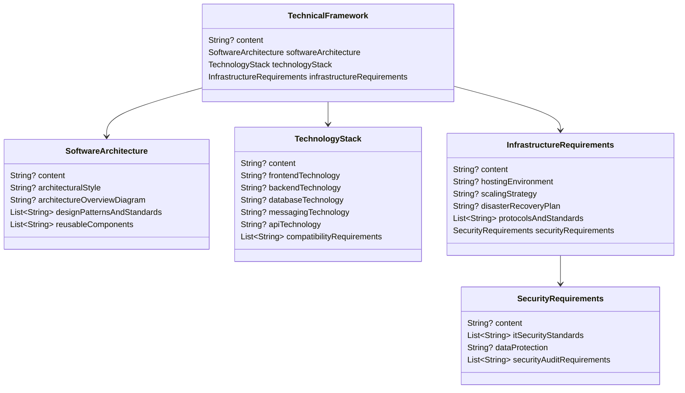
```mermaid
classDiagram
    class TechnicalFramework {
        String? content
        SoftwareArchitecture softwareArchitecture
        TechnologyStack technologyStack
        InfrastructureRequirements infrastructureRequirements
    }

    class SoftwareArchitecture {
        String? content
        String? architecturalStyle
        String? architectureOverviewDiagram
        List~String~ designPatternsAndStandards
        List~String~ reusableComponents
    }

    class TechnologyStack {
        String? content
        String? frontendTechnology
        String? backendTechnology
        String? databaseTechnology
        String? messagingTechnology
        String? apiTechnology
        List~String~ compatibilityRequirements
    }

    class InfrastructureRequirements {
        String? content
        String? hostingEnvironment
        String? scalingStrategy
        String? disasterRecoveryPlan
        List~String~ protocolsAndStandards
        SecurityRequirements securityRequirements
    }

    class SecurityRequirements {
        String? content
        List~String~ itSecurityStandards
        String? dataProtection
        List~String~ securityAuditRequirements
    }

    TechnicalFramework --> SoftwareArchitecture
    TechnicalFramework --> TechnologyStack
    TechnicalFramework --> InfrastructureRequirements
    InfrastructureRequirements --> SecurityRequirements
```

## 11. Section 9 — Access and Authorization [PD00-ACC]

```mermaid
classDiagram
    class AccessAndAuthorization {
        String? content
        UserManagement userManagement
        IdentificationAndAuthentication identification
        UserAuthorization authorization
        AuditAndLogging audit
    }

    class UserManagement {
        String? content
        UserCategories userCategories
        UserAttributes userAttributes
        String? provisioningProcess
        String? deprovisioningProcess
    }

    class UserCategories {
        String? content
        List~UserCategoryDefinition~ items
    }

    class UserCategoryDefinition {
        String? content
        String? categoryName
        String? description
        String? estimatedUserCount
        String? accessLevel
        String? typicalUsagePattern
    }

    class UserAttributes {
        String? content
        List~UserAttributeEntry~ items
    }

    class UserAttributeEntry {
        String? content
        String? attributeName
        String? attributeType
        String? description
        String? source
        String? validationRules
    }

    class IdentificationAndAuthentication {
        String? content
        AuthenticationMethods authenticationMethods
        String? identityProvider
        String? passwordPolicy
        String? mfaRequirements
        String? sessionManagement
    }

    class AuthenticationMethods {
        String? content
        List~AuthenticationMethodEntry~ items
    }

    class AuthenticationMethodEntry {
        String? content
        String? methodName
        String? methodType
        String? applicableUserCategories
        String? securityLevel
        String? fallbackMethod
    }

    class UserAuthorization {
        String? content
        String? authorizationModel
        List~AuthorizationGroupEntry~ groups
        List~RoleDefinition~ roleDefinitions
        List~EntitlementEntry~ entitlements
        List~ResourceKeyEntry~ resourceKeys
        String? delegationRules
    }

    class AuthorizationGroupEntry {
        String? content
        String? groupName
        String? description
        String? purpose
        List~String~ containedRoles
    }

    class RoleDefinition {
        String? content
        String? roleName
        String? description
        String? scope
        List~String~ responsibilities
        List~String~ entitlementReferences
        List~String~ mutualExclusions
        List~String~ typicalHolders
    }

    class EntitlementEntry {
        String? content
        String? entitlementName
        String? description
        String? entitlementType
        List~String~ resourceKeyReferences
        String? grantCondition
        String? revokeCondition
    }

    class ResourceKeyEntry {
        String? content
        String? resourceKeyName
        String? description
        String? resourceType
        String? granularity
        String? protectedResource
    }

    class AuditAndLogging {
        String? content
        String? loggingRequirements
        String? auditTrailRetention
        SecurityEvents securityEvents
        String? complianceReporting
    }

    class SecurityEvents {
        String? content
        List~SecurityEventEntry~ items
    }

    class SecurityEventEntry {
        String? content
        String? eventType
        String? description
        String? severity
        String? responseAction
        String? notificationTarget
    }

    AccessAndAuthorization --> UserManagement
    AccessAndAuthorization --> IdentificationAndAuthentication
    AccessAndAuthorization --> UserAuthorization
    AccessAndAuthorization --> AuditAndLogging
    UserManagement --> UserCategories
    UserManagement --> UserAttributes
    UserCategories --> "0..*" UserCategoryDefinition
    UserAttributes --> "0..*" UserAttributeEntry
    IdentificationAndAuthentication --> AuthenticationMethods
    AuthenticationMethods --> "0..*" AuthenticationMethodEntry
    UserAuthorization --> "0..*" AuthorizationGroupEntry
    UserAuthorization --> "0..*" RoleDefinition
    UserAuthorization --> "0..*" EntitlementEntry
    UserAuthorization --> "0..*" ResourceKeyEntry
    AuditAndLogging --> SecurityEvents
    SecurityEvents --> "0..*" SecurityEventEntry
```

## 12. Section 10 — User Interface Design [PD00-USE]

```mermaid
classDiagram
    class UserInterfaceDesign {
        String? content
        DesignVision designVision
        UserResearch userResearch
        InformationArchitecture informationArchitecture
        ScreenDesigns screenDesigns
        OutputDesign outputDesign
        Accessibility accessibility
        ResponsiveDesign responsiveDesign
        UiComponentLibrary componentLibrary
        Prototype prototype
    }

    class DesignVision {
        String? content
        String? overallDesignPhilosophy
        List~String~ designGoals
        List~String~ designPrinciples
        String? brandAlignment
    }

    class UserResearch {
        String? content
        List~PersonaEntry~ personas
        String? userJourneyMaps
    }

    class PersonaEntry {
        String? content
        String? personaName
        String? role
        String? description
        List~String~ goals
        List~String~ painPoints
        String? technologyComfort
    }

    class InformationArchitecture {
        String? content
        String? siteMap
        String? navigationModel
        String? searchStrategy
    }

    class ScreenDesigns {
        String? content
        List~ScreenEntry~ screens
    }

    class ScreenEntry {
        String? content
        String? screenId
        String? screenName
        String? purpose
        List~String~ keyElements
        List~String~ userCategories
        List~String~ entryPoints
        String? wireframeReference
        String? mockupReference
    }

    class OutputDesign {
        String? content
        PrintLayout printLayout
        List~ReportEntry~ reports
    }

    class PrintLayout {
        String? content
        List~String~ exportFormats
        String? pageSetup
    }

    class ReportEntry {
        String? content
        String? reportName
        String? description
        String? frequency
        List~String~ recipients
        String? format
    }

    class Accessibility {
        String? content
        String? complianceTarget
        String? screenReaderSupport
        String? keyboardNavigation
        String? colorContrastRequirements
        AccessibilityChecklist accessibilityChecklist
    }

    class AccessibilityChecklist {
        String? content
        List~AccessibilityCheckEntry~ items
    }

    class AccessibilityCheckEntry {
        String? content
        String? checkItem
        String? wcagCriterion
        String? priority
        String? verificationMethod
    }

    class ResponsiveDesign {
        String? content
        List~String~ breakpoints
        String? mobileFirstStrategy
        String? touchInteractionGuidelines
    }

    class UiComponentLibrary {
        String? content
        String? designSystem
        List~UiComponentEntry~ components
    }

    class UiComponentEntry {
        String? content
        String? componentName
        String? category
        String? description
        String? usage
        List~String~ states
        List~String~ variants
    }

    class Prototype {
        String? content
        String? prototypeType
        String? prototypeTooling
        List~String~ prototypeGoals
        String? prototypeScope
        String? prototypeTimeline
    }

    UserInterfaceDesign --> DesignVision
    UserInterfaceDesign --> UserResearch
    UserInterfaceDesign --> InformationArchitecture
    UserInterfaceDesign --> ScreenDesigns
    UserInterfaceDesign --> OutputDesign
    UserInterfaceDesign --> Accessibility
    UserInterfaceDesign --> ResponsiveDesign
    UserInterfaceDesign --> UiComponentLibrary
    UserInterfaceDesign --> Prototype
    UserResearch --> "0..*" PersonaEntry
    ScreenDesigns --> "0..*" ScreenEntry
    OutputDesign --> PrintLayout
    OutputDesign --> "0..*" ReportEntry
    Accessibility --> AccessibilityChecklist
    AccessibilityChecklist --> "0..*" AccessibilityCheckEntry
    UiComponentLibrary --> "0..*" UiComponentEntry
```

## 13. Section 11 — System Quality Goals [PD00-SYS-Q]

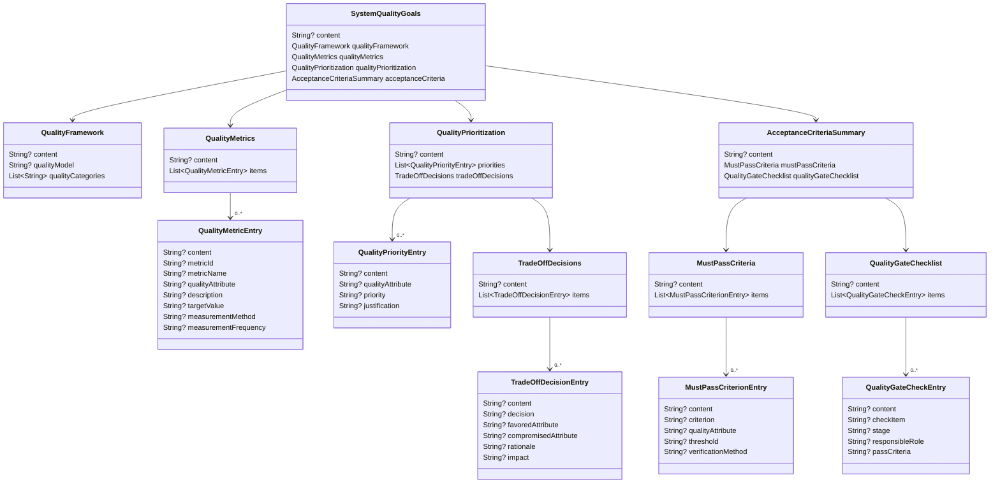
```mermaid
classDiagram
    class SystemQualityGoals {
        String? content
        QualityFramework qualityFramework
        QualityMetrics qualityMetrics
        QualityPrioritization qualityPrioritization
        AcceptanceCriteriaSummary acceptanceCriteria
    }

    class QualityFramework {
        String? content
        String? qualityModel
        List~String~ qualityCategories
    }

    class QualityMetrics {
        String? content
        List~QualityMetricEntry~ items
    }

    class QualityMetricEntry {
        String? content
        String? metricId
        String? metricName
        String? qualityAttribute
        String? description
        String? targetValue
        String? measurementMethod
        String? measurementFrequency
    }

    class QualityPrioritization {
        String? content
        List~QualityPriorityEntry~ priorities
        TradeOffDecisions tradeOffDecisions
    }

    class QualityPriorityEntry {
        String? content
        String? qualityAttribute
        String? priority
        String? justification
    }

    class TradeOffDecisions {
        String? content
        List~TradeOffDecisionEntry~ items
    }

    class TradeOffDecisionEntry {
        String? content
        String? decision
        String? favoredAttribute
        String? compromisedAttribute
        String? rationale
        String? impact
    }

    class AcceptanceCriteriaSummary {
        String? content
        MustPassCriteria mustPassCriteria
        QualityGateChecklist qualityGateChecklist
    }

    class MustPassCriteria {
        String? content
        List~MustPassCriterionEntry~ items
    }

    class MustPassCriterionEntry {
        String? content
        String? criterion
        String? qualityAttribute
        String? threshold
        String? verificationMethod
    }

    class QualityGateChecklist {
        String? content
        List~QualityGateCheckEntry~ items
    }

    class QualityGateCheckEntry {
        String? content
        String? checkItem
        String? stage
        String? responsibleRole
        String? passCriteria
    }

    SystemQualityGoals --> QualityFramework
    SystemQualityGoals --> QualityMetrics
    SystemQualityGoals --> QualityPrioritization
    SystemQualityGoals --> AcceptanceCriteriaSummary
    QualityMetrics --> "0..*" QualityMetricEntry
    QualityPrioritization --> "0..*" QualityPriorityEntry
    QualityPrioritization --> TradeOffDecisions
    TradeOffDecisions --> "0..*" TradeOffDecisionEntry
    AcceptanceCriteriaSummary --> MustPassCriteria
    AcceptanceCriteriaSummary --> QualityGateChecklist
    MustPassCriteria --> "0..*" MustPassCriterionEntry
    QualityGateChecklist --> "0..*" QualityGateCheckEntry
```

## 14. Section 12 — Components to Use [PD00-COM]

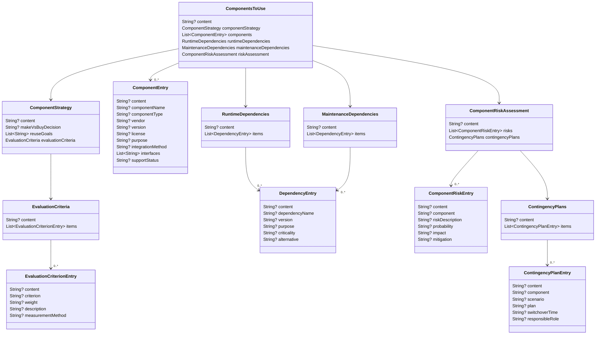
```mermaid
classDiagram
    class ComponentsToUse {
        String? content
        ComponentStrategy componentStrategy
        List~ComponentEntry~ components
        RuntimeDependencies runtimeDependencies
        MaintenanceDependencies maintenanceDependencies
        ComponentRiskAssessment riskAssessment
    }

    class ComponentStrategy {
        String? content
        String? makeVsBuyDecision
        List~String~ reuseGoals
        EvaluationCriteria evaluationCriteria
    }

    class EvaluationCriteria {
        String? content
        List~EvaluationCriterionEntry~ items
    }

    class EvaluationCriterionEntry {
        String? content
        String? criterion
        String? weight
        String? description
        String? measurementMethod
    }

    class ComponentEntry {
        String? content
        String? componentName
        String? componentType
        String? vendor
        String? version
        String? license
        String? purpose
        String? integrationMethod
        List~String~ interfaces
        String? supportStatus
    }

    class RuntimeDependencies {
        String? content
        List~DependencyEntry~ items
    }

    class MaintenanceDependencies {
        String? content
        List~DependencyEntry~ items
    }

    class DependencyEntry {
        String? content
        String? dependencyName
        String? version
        String? purpose
        String? criticality
        String? alternative
    }

    class ComponentRiskAssessment {
        String? content
        List~ComponentRiskEntry~ risks
        ContingencyPlans contingencyPlans
    }

    class ComponentRiskEntry {
        String? content
        String? component
        String? riskDescription
        String? probability
        String? impact
        String? mitigation
    }

    class ContingencyPlans {
        String? content
        List~ContingencyPlanEntry~ items
    }

    class ContingencyPlanEntry {
        String? content
        String? component
        String? scenario
        String? plan
        String? switchoverTime
        String? responsibleRole
    }

    ComponentsToUse --> ComponentStrategy
    ComponentsToUse --> "0..*" ComponentEntry
    ComponentsToUse --> RuntimeDependencies
    ComponentsToUse --> MaintenanceDependencies
    ComponentsToUse --> ComponentRiskAssessment
    ComponentStrategy --> EvaluationCriteria
    EvaluationCriteria --> "0..*" EvaluationCriterionEntry
    RuntimeDependencies --> "0..*" DependencyEntry
    MaintenanceDependencies --> "0..*" DependencyEntry
    ComponentRiskAssessment --> "0..*" ComponentRiskEntry
    ComponentRiskAssessment --> ContingencyPlans
    ContingencyPlans --> "0..*" ContingencyPlanEntry
```

## 15. Section 13 — System Stage Plan [PD00-STA]

```mermaid
classDiagram
    class SystemStagePlan {
        String? content
        StagePlanOverview stagePlanOverview
        List~StageEntry~ stages
        DataMigrationStrategy dataMigrationStrategy
        StageGovernance governance
    }

    class StagePlanOverview {
        String? content
        String? stagingRationale
        String? overallTimeline
        String? stagingCriteria
    }

    class StageEntry {
        String? content
        String? stageId
        String? stageName
        String? description
        String? startCondition
        String? endCondition
        String? duration
        List~String~ successCriteria
        ScopeDefinition scope
        List~String~ subStagesAndMilestones
    }

    class ScopeDefinition {
        String? content
        List~ScopeItemEntry~ includedItems
        List~ScopeItemEntry~ excludedItems
    }

    class ScopeItemEntry {
        String? content
        String? item
        String? category
        String? rationale
    }

    class DataMigrationStrategy {
        String? content
        String? migrationApproach
        MigrationPhases migrationPhases
        StageMigrationRisks migrationRisks
        String? rollbackPlan
    }

    class MigrationPhases {
        String? content
        List~MigrationPhaseEntry~ items
    }

    class MigrationPhaseEntry {
        String? content
        String? phaseName
        String? description
        String? duration
        String? dataScope
        String? validationApproach
    }

    class StageMigrationRisks {
        String? content
        List~StageMigrationRiskEntry~ items
    }

    class StageMigrationRiskEntry {
        String? content
        String? riskDescription
        String? probability
        String? impact
        String? mitigation
        String? contingency
    }

    class StageGovernance {
        String? content
        PhaseGateReviews phaseGateReviews
        DecisionPoints decisionPoints
        String? escalationProcess
    }

    class PhaseGateReviews {
        String? content
        List~PhaseGateReviewEntry~ items
    }

    class PhaseGateReviewEntry {
        String? content
        String? gateName
        String? stage
        List~String~ reviewCriteria
        String? approvalAuthority
        String? reviewSchedule
    }

    class DecisionPoints {
        String? content
        List~DecisionPointEntry~ items
    }

    class DecisionPointEntry {
        String? content
        String? decisionName
        String? stage
        String? description
        List~String~ options
        String? decisionMaker
        String? deadline
    }

    SystemStagePlan --> StagePlanOverview
    SystemStagePlan --> "0..*" StageEntry
    SystemStagePlan --> DataMigrationStrategy
    SystemStagePlan --> StageGovernance
    StageEntry --> ScopeDefinition
    ScopeDefinition --> "0..*" ScopeItemEntry
    DataMigrationStrategy --> MigrationPhases
    DataMigrationStrategy --> StageMigrationRisks
    MigrationPhases --> "0..*" MigrationPhaseEntry
    StageMigrationRisks --> "0..*" StageMigrationRiskEntry
    StageGovernance --> PhaseGateReviews
    StageGovernance --> DecisionPoints
    PhaseGateReviews --> "0..*" PhaseGateReviewEntry
    DecisionPoints --> "0..*" DecisionPointEntry
```

## 16. Section 14 — Delivery Scope and Acceptance [PD00-DEL]

```mermaid
classDiagram
    class DeliveryScopeAndAcceptance {
        String? content
        DeliveryScope deliveryScope
        AcceptancePlan acceptancePlan
    }

    class DeliveryScope {
        String? content
        SoftwareDeliverables softwareDeliverables
        DocumentationDeliverables documentationDeliverables
        TrainingDeliverables trainingDeliverables
        SupportDeliverables supportDeliverables
    }

    class SoftwareDeliverables {
        String? content
        List~DeliverableEntry~ items
    }

    class DocumentationDeliverables {
        String? content
        List~DeliverableEntry~ items
    }

    class TrainingDeliverables {
        String? content
        List~DeliverableEntry~ items
    }

    class SupportDeliverables {
        String? content
        List~DeliverableEntry~ items
    }

    class DeliverableEntry {
        String? content
        String? deliverableName
        String? description
        String? format
        String? deliveryDate
        String? responsibleRole
        String? acceptanceCriteria
    }

    class AcceptancePlan {
        String? content
        AcceptanceCriteriaList acceptanceCriteria
        AcceptanceProcess acceptanceProcess
        UserAcceptanceTesting userAcceptanceTesting
    }

    class AcceptanceCriteriaList {
        String? content
        List~AcceptanceCriterionEntry~ items
    }

    class AcceptanceCriterionEntry {
        String? content
        String? criterionId
        String? criterion
        String? category
        String? verificationMethod
        String? threshold
        String? responsibleRole
    }

    class AcceptanceProcess {
        String? content
        List~String~ steps
        String? timeline
        String? participants
        String? escalationProcess
    }

    class UserAcceptanceTesting {
        String? content
        String? scope
        String? environment
        String? participants
        String? schedule
        List~String~ testScenarios
        String? exitCriteria
    }

    DeliveryScopeAndAcceptance --> DeliveryScope
    DeliveryScopeAndAcceptance --> AcceptancePlan
    DeliveryScope --> SoftwareDeliverables
    DeliveryScope --> DocumentationDeliverables
    DeliveryScope --> TrainingDeliverables
    DeliveryScope --> SupportDeliverables
    SoftwareDeliverables --> "0..*" DeliverableEntry
    DocumentationDeliverables --> "0..*" DeliverableEntry
    TrainingDeliverables --> "0..*" DeliverableEntry
    SupportDeliverables --> "0..*" DeliverableEntry
    AcceptancePlan --> AcceptanceCriteriaList
    AcceptancePlan --> AcceptanceProcess
    AcceptancePlan --> UserAcceptanceTesting
    AcceptanceCriteriaList --> "0..*" AcceptanceCriterionEntry
```

---

## Summary

**Total classes: ~184** (including enums and shared entry types)

| Section | Classes | Notable Patterns |
|---------|---------|-----------------|
| Top-level | 1 | PdProjectDefinition aggregator |
| Common types | 4+ | Requirement, Risk, Glossary (shared) |
| Current State Analysis | ~15 | DataSourceEntry (combined), ProcessMetrics, DependenciesAndIntegrations |
| Project Organization | ~12 | Unchanged from v1 |
| Administrative | ~8 | ChangeStepEntry with subflowDiagram |
| System Overview | ~25 | UserInteractionModel, SystemMigrationConsiderations, MigrationRisks |
| Organizational Framework | ~12 | WorkplaceDescriptionEntry per user category |
| Target Business Process | ~14 | PrimaryInteractions wrapper, AlternativeFlowEntry |
| Business Data Model | ~12 | EntityRelationships, List<String> patterns |
| Technical Framework | ~5 | List<String> design patterns + standards |
| Access & Authorization | ~18 | Tom Core auth model (groups→roles→entitlements→resourceKeys) |
| User Interface Design | ~16 | AccessibilityChecklist, List<String> patterns |
| System Quality Goals | ~12 | TradeOffDecisions, MustPassCriteria, QualityGateChecklist |
| Components | ~12 | RuntimeDependencies, ContingencyPlans wrappers |
| System Stage Plan | ~14 | MigrationPhases, PhaseGateReviews, DecisionPoints |
| Delivery & Acceptance | ~13 | 4 deliverable wrappers, AcceptanceProcess, UAT |

All classes annotated with `@tomReflector`. Every class has `String? content` for section-level prose.
